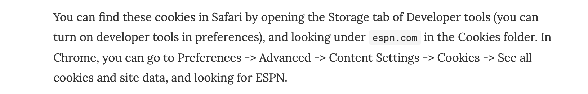
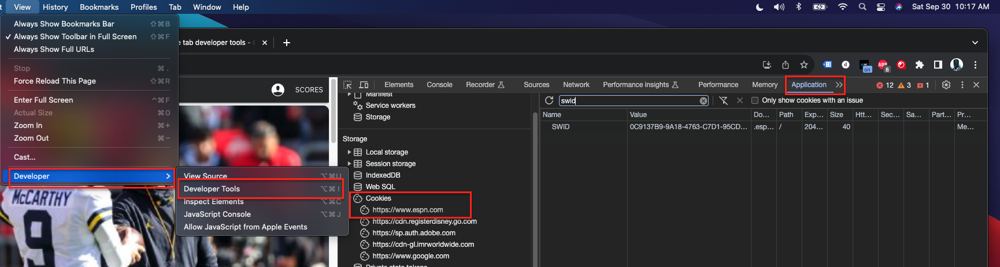

# espn_fantasy_football_api
ESPN Fantasy Football API Connection

### Get Your ESPN Cookies

For private leagues, you'll need your espn_s2 and swid cookies

and 

### Three Steps

1. Update config.yaml to use your league_id
2. Update config.yaml to use your espn_s2 and swid
3. run $ python get_all_fantasy_data.py
